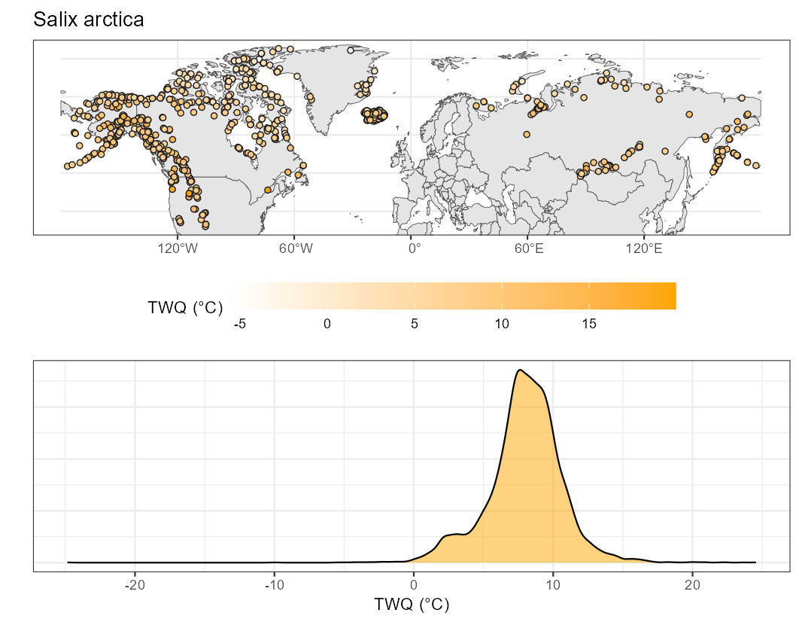

# ClimNicheHub

*This repository stores the climatic niche estimation of 893 vascular plant species recorded in the International Tundra EXperiment database ([ITEX](https://www.gvsu.edu/itex/)).*

## Description

The niches were estimated by first pulling the first **10,000** occurrences from the [GBIF](https://www.gbif.org/). After a filtering of the occurrences based on coordinates , we extracted the bioclimatologies from the latest version of the [CHELSA V2.1](https://chelsa-climate.org/) global climatology database. For each species, the mean, median, the quantile 5% and 95%, the interquantile range and the mode were computed from the distribution of each bioclimatic CHELSA variable where the species occurred. Species with less than 100 filtered occurrences were discarded from the niche computation.

To analyse species climatic niche in a multivariate framework, a PCA was also conducted to reduce the dimension of every CHELSA cells where at least one species occurred. The results of the PCA as well as the centroïds of each species projected in this PCA space are also available.

## Data list

In `ClimNiche_database`, `ClimNiche_climate_summary.csv` presentes the summary statistics for each climate variable of each species, `ClimNiche_pca_summary.csv` contains the centroïds of each species occurrence projected in the PCA and `ClimNiche_sampling_summary.csv` doubles as a list of taxonomic synonym with the ITEX database and a count of how many occurrences were used in the niche computation.

The `Complete_sampling` folder contains all of the CHELSA cells (`all_CHELSA_cells.Rdata`) where at least one species occurrences, along with a unique cell_id identifier. `species_cells.RData` contains every cell_id where every species occurred, allowing for creating the full sampling back with a merge function.

The folder `raw_occ` contains the the 10,000 (or less) raw occurrence downloaded from GBIF before 15-feb-2015, in .RData format. The folder `filtered_occ` folder contains processed raw occurrences filtered by the occTest packages, removing duplicates within a CHELSA pixel, as well as test for various coordinates errors. chelsa_data_V2.1 contain the metadata behind the CHELSA bioclimatic name, and should contain the CHELSA rasters. They are not included but can be download with the script `download_CHELSA_V2.1.R` .

## Scripts

`00_getting_occ_data.R` downloads the raw occurrences from GBIF, `01_filtering_occ.R` apply the geographical filters included in the `occTest` package. `02_getting_clim_niche.R` extracts the climatic variable for each occurrences, performs the various summary metrics computation and the PCA-based analysis. None of these has to be ran again to gain access the final estimation of species climatic niches.

These script can be used to extend the analysis to non-vascular taxa.

### Acknowledgment 

We are grateful to the creators and the maintainere of the packages `spocc`, `occTest`, `terra`, `sf` and `data.table` that greatly facilitated our analysis, as well to the many data contributors to the GBIF and its sub-repositories (such as INaturalist). JB and IMS were funded by the ERC synergy grand n°101071417.

### Authors

Jeremy Borderieux, Isla H. Myers-Smith

### Data use guidelines and citation

This dataset can be cited alongside the upcoming publication that motivated its creation. If the publication is not out yet, please get in touch with the authors.

Data are publicly available using a Creative Commons Attribution 4.0 International copyright (CC BY 4.0). Data are fully public but should be appropriately referenced by citing the paper. Although not mandatory, we additionally suggest that data users contact and collaborate with data contributors if this dataset will contribute a substantial proportion of observations used in a particular paper or analysis.
